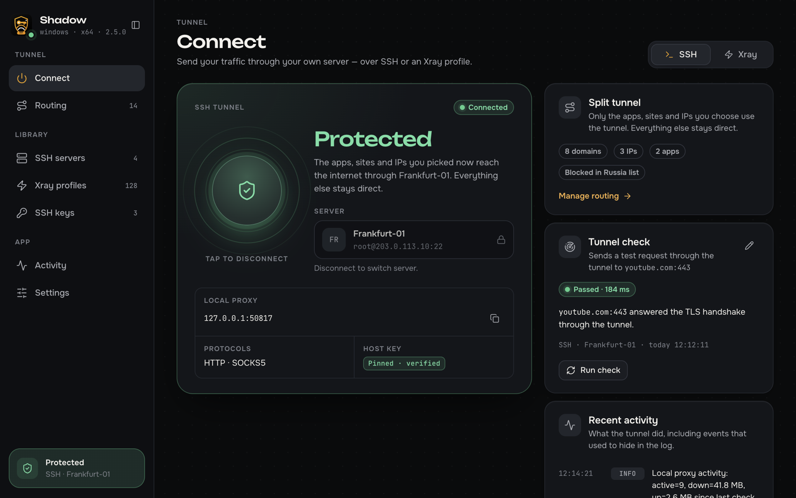
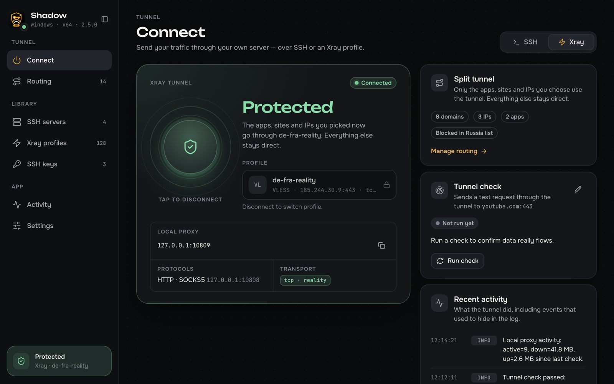
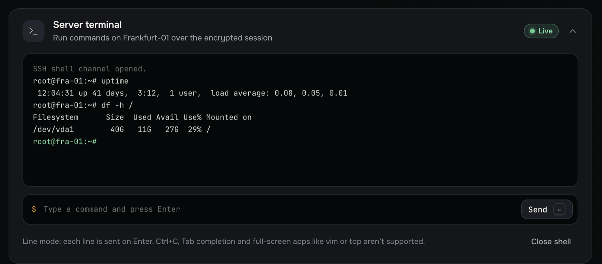
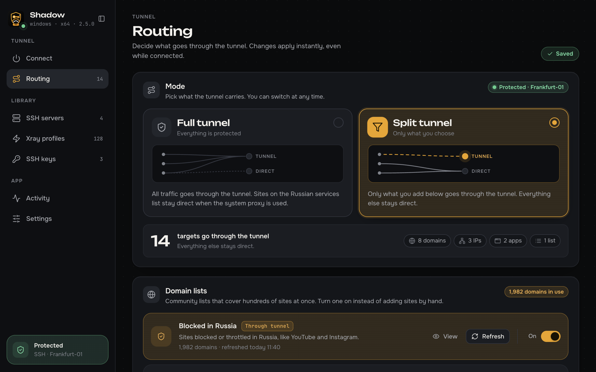
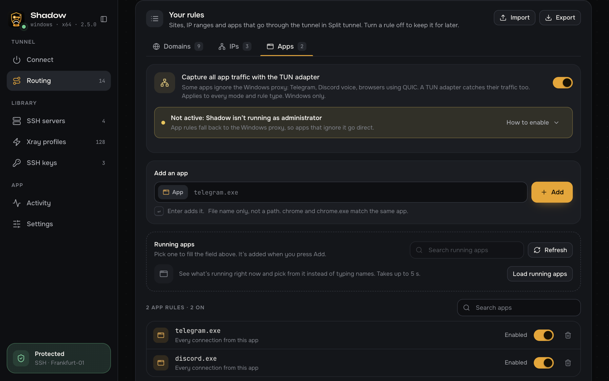
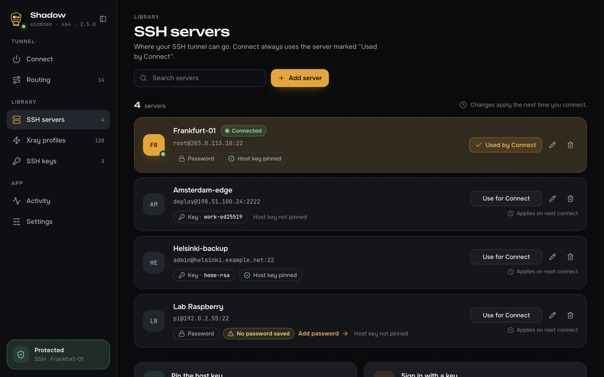
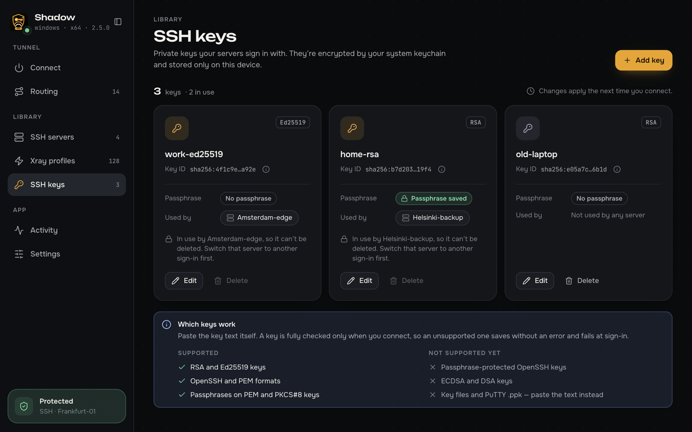
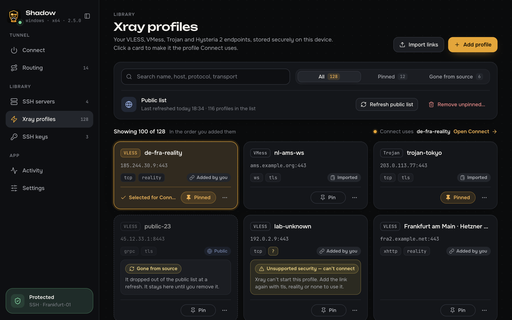
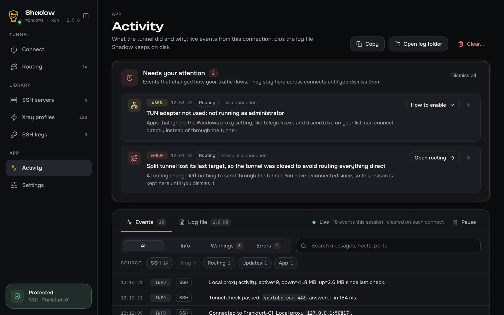
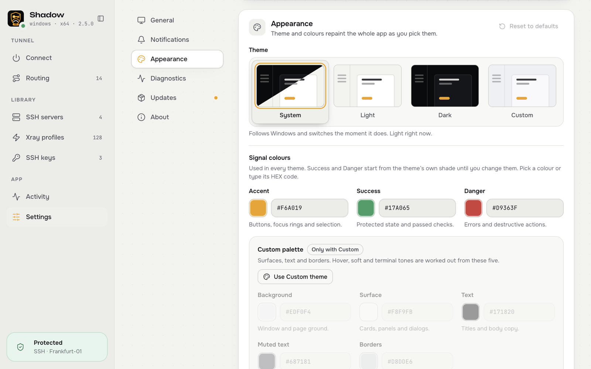

# Shadow

[Русский](README.md) · **English**

> **Disclaimer.** This app is a test of whether today's neural networks can build applications with minimal
> developer involvement. The answer is **yes**.

Shadow is a desktop client that sends your traffic through your own server, over SSH or through Xray
(VLESS, VMess, Trojan, Hysteria 2). It runs on Windows, macOS and Linux.



## Features

- **Two ways to connect.** An SSH tunnel to any server you can SSH into, with nothing to install on the server.
  Or an Xray profile from a `vless://`, `vmess://`, `trojan://` or `hysteria2://` link.
- **Split tunnel.** Only the sites, IP addresses and apps you pick go through the server; everything else stays
  direct. Or send all traffic through the tunnel.
- **Ready-made site lists.** Turn on the "blocked in Russia" list with one switch instead of adding hundreds of rules.
- **Reconnects on its own.** When the link drops after sleep, a Wi-Fi change or a server hiccup, Shadow brings the
  tunnel back without you.
- **Keeps secrets safe.** Passwords, keys and links are encrypted by the system store (Windows DPAPI, macOS Keychain,
  Linux keyring) and never reach the logs.
- **Lives in the tray.** Closing the window doesn't drop the tunnel; on Windows Shadow can start with the system.

## Screenshots

### Connect

One big button. Pick the transport at the top: SSH or Xray. Next to it are the routing summary and the tunnel check,
which sends a test request through the server and shows whether it arrived and how fast.



SSH servers come with a built-in terminal, so you can run a command on the server without another client.



### Routing

Full tunnel or split tunnel. In split mode only the domains, IP addresses, apps and domain lists you chose go through
the server. Changes apply instantly, even while connected. Rules steer traffic on Windows (see the
[table below](#platform-support)).



App rules: type `telegram.exe` or pick a program from the running ones, and all of its traffic goes through the
tunnel. The TUN adapter also catches apps that ignore the system proxy. Rules can be imported and exported.



### SSH servers and keys

Sign in with a password or a key (RSA, Ed25519; OpenSSH and PEM formats). Pin the server's fingerprint so a
swapped host can't go unnoticed.





### Xray profiles

Paste one link or many, one per line: links you already have are updated, not duplicated. Profiles can be searched,
pinned and renamed. The public profile list is only downloaded when you press its button.



### Activity

Important events, such as the TUN adapter not starting or the tunnel closing because no rules were left, stay on top
until you dismiss them. Below are the live event feed and the log file. Passwords and keys never reach the log.



### Appearance

Light, dark or a custom theme, with your own accent colours.



## Platform support

|                                              | Windows | macOS | Linux |
| -------------------------------------------- | :-----: | :---: | :---: |
| SSH and Xray tunnel                          |   ✅    |  ✅   |  ✅   |
| Local HTTP and SOCKS5 proxy                  |   ✅    |  ✅   |  ✅   |
| System proxy set automatically               |   ✅    |   —   |   —   |
| Split tunnel: sites, IPs, lists              |   ✅    |   —   |   —   |
| App rules                                    |   ✅    |   —   |   —   |
| TUN adapter (run as administrator)           |   ✅    |   —   |   —   |
| Tray or menu bar icon                        |   ✅    |  ✅   |  ✅   |
| Launch at sign-in                            |   ✅    |   —   |   —   |

On macOS and Linux Shadow opens a local proxy on `127.0.0.1`. The Connect screen shows its address: set it in your
browser or in the app you want to tunnel.

## Install

Download the file for your system from the [latest release](https://github.com/stansful/ssh-vpn-client-electron/releases/latest).

| System              | File                                                            |
| ------------------- | --------------------------------------------------------------- |
| Windows 10/11       | `…-windows-portable-x64.exe` or `…-arm64.exe`, no install needed |
| macOS               | `…-macos-dmg-arm64.dmg` (Apple Silicon) or `…-x64.dmg` (Intel)  |
| Linux               | `….AppImage` or a `….deb` package for x64 and arm64             |

The builds aren't signed with Microsoft or Apple certificates, so the system warns you on first launch:

- **Windows:** in the SmartScreen window click "More info" → "Run anyway".
- **macOS:** open System Settings → Privacy & Security and click "Open Anyway". If macOS says the app is damaged,
  run `xattr -dr com.apple.quarantine /Applications/Shadow.app`.

Check for updates in Settings → Updates: Shadow finds the new version on GitHub, downloads and verifies the file,
and you install it yourself. Upgrading from Shadow SSH 2.4.0 or earlier? See the
[migration notes](docs/DEVELOPMENT.md).

## Quick start

1. Add a server under "SSH servers", or paste a link under "Xray profiles".
2. In "Routing", choose a mode: all traffic or only what you pick.
3. Press the big button on the "Connect" screen.

## For developers

You need Node.js 22.12+ (or 24+) and npm 10+. Building the installers also needs Go 1.23+.

```bash
npm install
npm run dev        # the app in development mode
npm test           # tests
npm run build:prod # release builds for every system, into release/
```

You can also open the interface in a plain browser with demo data: run `npx vite`, then open
`http://localhost:5173/?scenario=connected`. That's how the screenshots above were made.

Building, packaging and how the tunnel and routing work inside are covered in [docs/DEVELOPMENT.md](docs/DEVELOPMENT.md).
